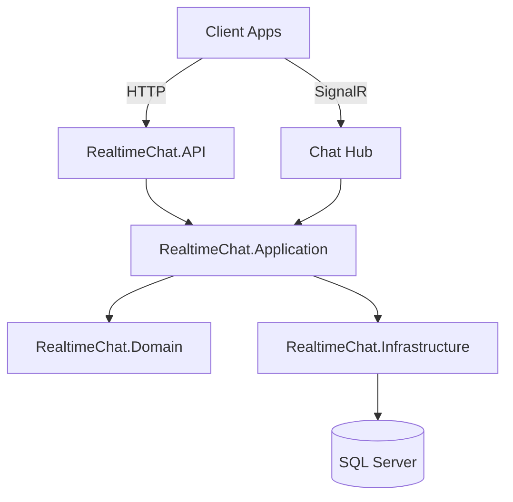

# RealtimeChat
Production-ready real-time chat backend built with .NET 10, Clean Architecture, SignalR, and JWT auth.

[](https://github.com/yourusername/realtimechat/actions)
[](https://github.com/yourusername/realtimechat/actions)

## Architecture


## Features
- [x] Clean Architecture (Domain, Application, Infrastructure, API)
- [x] JWT auth with refresh tokens
- [x] SignalR real-time messaging
- [x] Typing indicators and presence
- [x] Read receipts and reactions
- [x] Rooms/groups
- [x] Structured logging with Serilog
- [x] FluentValidation + Problem Details
- [x] Swagger API documentation

## Tech Stack
| Area | Choice |
| --- | --- |
| Language | C# (.NET 10) |
| Framework | ASP.NET Core Web API |
| Database | SQL Server + EF Core |
| Auth | ASP.NET Core Identity + JWT |
| Real-time | SignalR |
| Validation | FluentValidation |
| Testing | xUnit, Moq, FluentAssertions |
| Logging | Serilog (JSON) |

## Local Setup (max 5 commands)
```bash
git clone https://github.com/yourusername/realtimechat.git
cd realtimechat
dotnet restore
dotnet ef database update --project RealtimeChat.Infrastructure --startup-project RealtimeChat.API
dotnet run --project RealtimeChat.API
```

API: `http://localhost:5100`  
Swagger: `http://localhost:5100/swagger`

## Key Technical Decisions
- **Clean Architecture** keeps business rules isolated from frameworks and infrastructure.
- **SignalR** provides low-latency bi-directional messaging for chat features.
- **JWT with refresh tokens** balances security (short-lived access tokens) with usability.

## Roadmap (Azure)
- Azure SignalR Service
- Azure Cosmos DB
- Azure OpenAI assistant bot
- Application Insights
- Entra ID authentication
- GitHub Actions CI/CD
